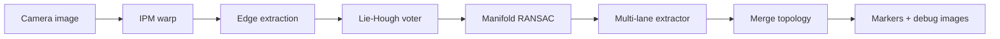

# lie_lane_detection

ROS 2 (Jazzy) C++ package for **multi-lane road boundary detection** in bird's-eye view (BEV). The pipeline combines inverse perspective mapping (IPM), steerable edge extraction, a **Lie-algebra Hough voter**, and **manifold-aware RANSAC** on a deformable lane template.

Detection runs in BEV pixel space. Curved roads, Y-merges, and lane splits are modeled with curvature (`kappa`) and merge/diverge shear (`sigma`) on top of an SE(2) pose.

For deeper mathematical context, graded-Lie analogies, and a refinement roadmap (including notes tied to [this lecture on graded Lie algebras and curve families](https://www.youtube.com/watch?v=TlAnOMjybJg&t=654s)), see **[docs/MATHEMATICS.md](docs/MATHEMATICS.md)**.

Improvements inspired by Lewis et al. (IVCNZ 2016) parabolic Hough + RHT for power lines are documented in **[docs/LEWIS_HOUGH_CURVES.md](docs/LEWIS_HOUGH_CURVES.md)**.

A planned **line-first → Lie-curve** variant (OpenCV `HoughLinesP` then Lie-Hough grouping) is described in **[docs/LINE_TO_CURVE_HOUGH.md](docs/LINE_TO_CURVE_HOUGH.md)**. It runs in a separate node for side-by-side comparison.

### Compare edge vs line pipelines

**Offline (all synthetic scenes):**

```bash
compare_lane_detection --scenes /home/mosal/rviz_ws/lane_detection_test_images \
  --output /tmp/lie_lane_compare
```

**ROS (both nodes, different topics):**

```bash
ros2 launch lie_lane_detection compare_pipelines.launch.py
```

| Pipeline | Node | Marker topic | Debug topics |
|----------|------|--------------|--------------|
| Edge-pixel Lie-Hough | `lane_detector_node` | `/lanes/markers` | `/lanes/debug/*` |
| Line-first Lie-Hough | `line_lane_detector_node` | `/lanes_line/markers` | `/lanes_line/debug/*` |

Line node also publishes `/lanes_line/stats` (latency + segment count).

---

## Pipeline overview



| Stage | Module | Role |
|-------|--------|------|
| 1 | `preprocessing/IPMTransformer` | Warp forward camera view to metric BEV |
| 2 | `preprocessing/EdgeExtractor` | CLAHE + steerable Sobel bank + hysteresis |
| 3 | `voting/LieHoughVoter` | Coarse-to-fine voting in SE(2) + (kappa, sigma) |
| 4 | `fitting/ManifoldRansac` | Refine each seed; inliers on the lane manifold |
| 5 | `extraction/MultiLaneExtractor` | NMS, quality gates, lane roles |
| 6 | `extraction/MergeTopology` | Label parallel / merge / diverge pairs |

Heavy steps use **Intel TBB** (`parallel_for`, `parallel_reduce`) for multi-core speed.

---

## Lane model

Each lane boundary is a **5D parameter vector** `xi`:

```
xi = (vx, vy, omega, kappa, sigma)
      |    |    |       |       |
      |    |    |       |       +-- merge/diverge linear drift along forward axis
      |    |    |       +---------- curvature (quadratic lateral drift)
      |    |    +-------------------- SE(2) rotation (heading in BEV)
      |    +------------------------- SE(2) lateral offset
      +------------------------------ SE(2) forward / lateral translation (vx dominant in BEV)
```

A **deformable template** is defined in normalized forward coordinate `t in [0, 1]`:

1. **Deform** the base polyline: `x = kappa * yn^2 * y_span + sigma * yn * y_span`
2. **Warp** with SE(2) via Sophus: `p = exp(xi_se2) * deform(t)`

In BEV images, lane markings appear roughly vertical; `vx` is the main lateral offset in pixels. `omega` tilts the lane, `kappa` bends it, and `sigma` models boundaries that converge or diverge toward the far field.

---

## Stage details

### 1. IPM (optional for live camera)

`IPMTransformer` maps an image trapezoid (`ipm_src_points`, 4 corners in pixels) to a metric BEV rectangle (`ipm_dst_points`, meters). Default BEV is **12 m wide x 40 m long** at **0.05 m/px** (240 x 800 px).

Tune `ipm_src_points` per camera mount. Offline testing on TuSimple/CULane frames uses `--perspective` with an auto-scaled highway trapezoid.

### 2. Edge extraction

- Grayscale + **CLAHE** contrast normalization
- Optional **anisotropic Gaussian blur** (Lewis et al.) — stronger smoothing along lateral axis in BEV
- **Steerable filter bank** (5 orientations) or plain Sobel
- Optional morphological **close** to bridge dashed lane gaps
- **Hysteresis** thresholding
- Optional **morphological thinning** (skeleton) for one-pixel-wide edges
- Edge points collected via `cv::findNonZero` (TBB-parallelized)

### 3. Lie-Hough voting (two stages)

**Stage A — SE(2) accumulator**

- For each edge point, vote only in **vx bins near the point** (localized voting)
- Distance to the template is minimized over several **deformation presets** (straight, +/-kappa, +/-sigma) so curved and merge geometry is not missed
- Votes accumulated in a flat 3D histogram `(vx, vy, omega)` with TBB `parallel_reduce`

**Stage B — (kappa, sigma) refinement**

- For each top SE(2) peak, search kappa/sigma bins
- Local fine search around the best coarse bin
- Non-maximum suppression in full 5D hypothesis space

### 4. Manifold RANSAC

For each Hough seed:

1. Collect edge candidates near the seed curve
2. **RANSAC** with minimal 5-point fits; **kappa and sigma are preserved** from the seed during minimal solves
3. Count geodesic inliers (point-to-curve distance)
4. **Gauss–Newton** on the SE(2) manifold for `(vx, vy, omega)`, with Euclidean updates for `kappa` and `sigma`
5. Re-count inliers after refinement; optional second GN pass

RANSAC iterations run in parallel via TBB.

### 5. Multi-lane extraction

- Sort hypotheses by score; greedily keep non-duplicates
- Drop lanes below `min_inlier_ratio`, too close in `vx`, or sharing too many supporting edges
- Assign roles: left/right ego, adjacent, center
- **Iterative peeling** (optional): detect strongest lane, remove its inlier edges, repeat Hough until no strong seed remains

### 6. Merge topology

Compare pairs of detected lanes: if lateral separation shrinks along the forward axis → **merge**; if it grows → **diverge**; otherwise **parallel**. Publishes merge markers for RViz.

---

## ROS 2 usage

### Build

```bash
cd /home/mosal/rviz_ws
source /opt/ros/jazzy/setup.bash
colcon build --packages-select lie_lane_detection
source install/setup.bash
```

**Dependencies:** OpenCV, Eigen3, Sophus, TBB (`libtbb-dev`).

### Launch

```bash
ros2 launch lie_lane_detection lane_detector.launch.py \
  image_topic:=/camera/image_raw \
  camera_info_topic:=/camera/camera_info
```

### Published topics

| Topic | Type | Description |
|-------|------|-------------|
| `/lanes/markers` | `visualization_msgs/MarkerArray` | Detected lane polylines |
| `/lanes/merge_markers` | `visualization_msgs/MarkerArray` | Merge/diverge events |
| `/lanes/debug/bev` | `sensor_msgs/Image` | IPM bird's-eye image |
| `/lanes/debug/overlay` | `sensor_msgs/Image` | Lanes drawn on BEV |
| `/lanes/debug/edges` | `sensor_msgs/Image` | Edge map |
| `/lanes/debug/hough` | `sensor_msgs/Image` | Hough accumulator slice |

### Parameters

See `config/lane_detector.yaml`. Key groups:

- **BEV / IPM:** `bev_width_m`, `bev_length_m`, `bev_resolution_m_per_px`, `ipm_src_points`, `ipm_dst_points`
- **Edges:** `edge_low_threshold`, `edge_high_threshold`, `connect_dashed_edges`
- **Hough:** `vote_threshold_px`, `top_k_peaks`, `kappa_min/max`, `sigma_min/max`
- **RANSAC:** `inlier_threshold_px`, `min_inlier_ratio`, `ransac_iterations`
- **Multi-lane:** `use_iterative_peeling`, `min_lane_separation_px`, `edge_border_margin_ratio`

---

## Offline tools

### Detect on a BEV image

```bash
lane_detect_offline --image path/to/bev.png --output /tmp/results
```

### Detect on a forward camera image (auto IPM)

```bash
lane_detect_offline --image path/to/tusimple.jpg --output /tmp/results --perspective
```

Outputs: `overlay.png`, `edges.png`, `hough_slice.png`, `report.txt` (includes timing in ms).

### Generate synthetic test suite

```bash
generate_test_images --output /home/mosal/rviz_ws/lane_detection_test_images --detect
```

Creates 9 BEV scenes with `ground_truth.txt`, `detection_report.txt`, and `curve_eval.txt` (pose error vs GT).

---

## Test data

| Location | Content |
|----------|---------|
| `lane_detection_test_images/` | 9 synthetic BEV scenes (straight, curved, merge, split, dashed, occlusion, IPM-style, combined) |
| `lane_detection_test_images/real_dataset/` | 4 public benchmark frames (TuSimple x3, CULane x1) + `results_*` folders |

Synthetic curved scenes (`02_curved_highway`, `08_split_diverge`, `09_combined_challenge`) are the primary regression set for kappa/sigma/omega accuracy.

---

## Package layout

Headers under `include/lie_lane_detection/` mirror `src/` by module:

```
lie_lane_detection/
├── include/lie_lane_detection/
│   ├── core/              types.hpp — XiVector, PipelineParams, LaneHypothesis
│   ├── geometry/          deformable lane template (TemplateCurve)
│   ├── preprocessing/     IPM warp, edge extraction
│   ├── voting/            edge Lie-Hough + line Hough + line Lie-Hough
│   ├── fitting/           manifold RANSAC
│   ├── extraction/        multi-lane NMS, merge/diverge topology
│   ├── pipeline/          runners, pipelines, shared quality gates
│   ├── visualization/     overlay + RViz markers
│   ├── common/            TBB helpers (parallel.hpp)
│   └── testing/           synthetic BEV generator, test helpers
├── src/
│   ├── geometry/ … voting/ … fitting/ … extraction/ … pipeline/ …
│   ├── visualization/
│   ├── testing/
│   ├── nodes/             lane_detector_node, line_lane_detector_node
│   └── tools/             offline runners, compare_lane_detection
├── test/                  gtests mirroring src/ modules
│   ├── geometry/
│   ├── voting/
│   ├── fitting/
│   ├── extraction/
│   └── pipeline/
├── config/                lane_detector.yaml, lane_detector_line.yaml
├── launch/                lane_detector, compare_pipelines
├── docs/                  MATHEMATICS.md, LEWIS_HOUGH_CURVES.md, …
└── README.md
```

**Executables**

| Binary | Location | Purpose |
|--------|----------|---------|
| `frontal_ipm_node` | `src/nodes/` | Auto-IPM: camera → `/ipm/bev` |
| `bev_lane_detector_node` | `src/nodes/` | BEV-only lane detection |
| `bev_mosaic_node` | `src/nodes/` | Temporal BEV orthomosaic (ECC / ORB registration) |
| `tracked_lane_detector_node` | `src/nodes/` | **Deprecated** monolithic IPM + detect |
| `lane_detector_node` | `src/nodes/` | Edge-pixel Lie-Hough ROS node (manual IPM) |
| `line_lane_detector_node` | `src/nodes/` | Line-first Lie-Hough ROS node (manual IPM) |
| `lane_detect_offline` | `src/tools/` | Single-image offline runner |
| `compare_lane_detection` | `src/tools/` | Edge vs line A/B comparison |
| `generate_test_images` | `src/tools/` | Synthetic dataset + batch detect |

**Core library:** `lie_lane_detection_core` — entry points:
- `detectLanesInBev()` → `pipeline/lane_detection_runner.hpp`
- `detectLanesInBevFromLines()` → `pipeline/line_lane_detection_runner.hpp`

---

## Performance notes

- Full synthetic suite (9 scenes): ~60 s on a typical desktop CPU with TBB
- Single 240x800 BEV frame: ~1–4 s depending on edge count and peel iterations
- Not real-time yet; main cost is Lie-Hough + iterative peeling on dense edges

Optimizations in place: localized vx voting, flat accumulators, edge subsampling for noisy IPM warps, TBB parallel Hough/RANSAC/edges.

---

## Unit tests

```bash
colcon test --packages-select lie_lane_detection --event-handlers console_direct+
```

Tests cover template sampling, Lie-Hough recovery (straight + curved), manifold RANSAC refinement, multi-lane NMS, and merge topology labeling.

---

## Iteration roadmap

**v1 (current):** Detection only — IPM, edges, Lie-Hough, manifold RANSAC, multi-lane, merge topology.

**v2 (planned):** GNN lane graph verifier, UKF temporal tracking, custom `lie_lane_msgs`.

---

## License

Apache-2.0
