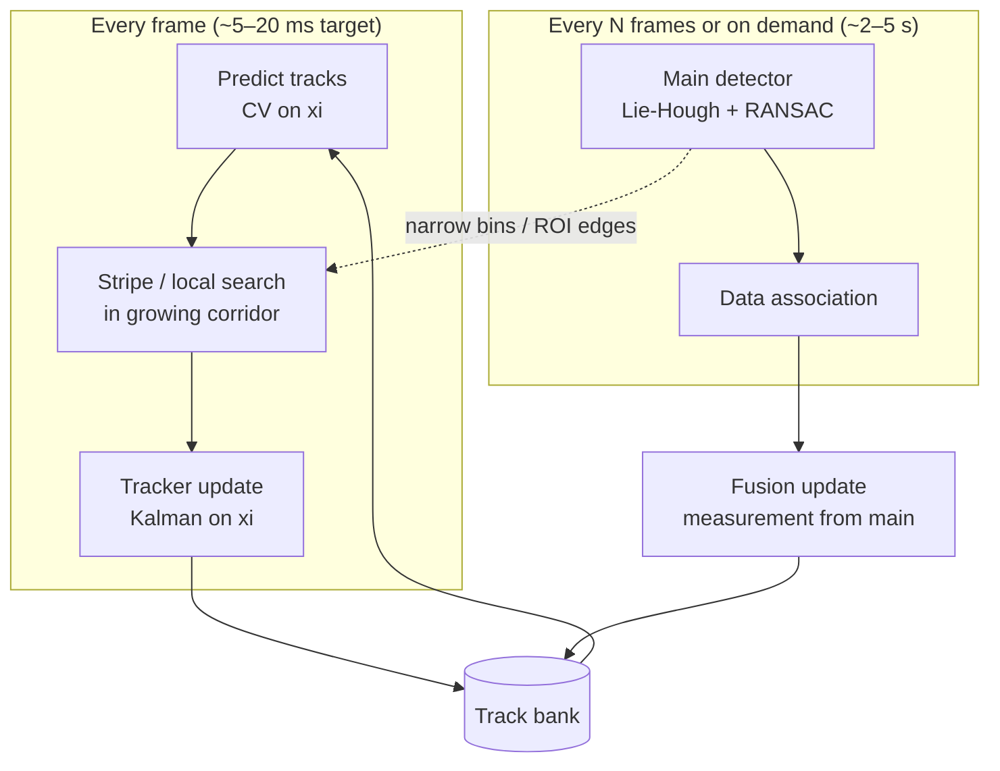

# Lightweight lane tracking (design)

Goal: run a **fast tracker every frame** using priors from the last state, and let the **heavy Lie-Hough + RANSAC** pipeline correct tracks at a lower rate. The tracker shrinks the search space; the main detector provides high-confidence Bayesian measurements.

---

## Architecture: two-rate fusion



| Layer | Rate | Role |
|-------|------|------|
| **Track predict** | 30 Hz | Constant-velocity (CV) on `xi`; grow uncertainty with forward distance |
| **Local search** | 30 Hz | Find edge support only inside predicted corridor |
| **Track update** | 30 Hz | Cheap Kalman / diagonal fusion from stripe hits |
| **Main detector** | 2–10 Hz | Full hypothesis generation; corrects drift, adds/drops lanes |
| **Association + fusion** | on main output | Match detections to tracks; Bayesian merge |

---

## State per lane track

Reuse the existing 5D lane model `xi = (vx, vy, omega, kappa, sigma)` plus velocity and uncertainty.

```text
Track state (minimal, online-friendly):
  xi          — lane parameters (same as LaneHypothesis)
  xi_dot      — pseudo-velocity (CV model), start at 0
  P           — 5×5 covariance on xi (diagonal OK for v1)
  track_id    — stable ID across frames
  age, misses — lifecycle
  role        — LEFT_EGO, RIGHT_EGO, … (from MultiLaneExtractor)
```

**Why `xi` and not polyline points?**  
The template curve already parameterizes the manifold; `hypothesisDistance()` and `ManifoldRansac::refineGaussNewton()` work in this space. Polyline samples are derived for viz only.

**Pseudo-velocity (v1):**  
Finite difference between frames, heavily low-pass filtered:

```text
xi_dot <- (1 - beta) * xi_dot + beta * (xi_k - xi_{k-1}) / dt
```

Later: estimate from ego motion (wheel odometry / visual odometry) to separate lane motion from ego motion.

---

## Growing search corridor (your normal-distribution idea)

For each track, at forward coordinate `y` (near = bottom of BEV, far = top):

```text
sigma_lat(y) = sigma_0 + alpha * (y / y_max)^p     // p ≈ 1..2
search_half_width(y) = k * sigma_lat(y)            // k ≈ 2..3
```

Interpretation:
- **Near field** (large `y` in image, close to ego): small lateral std → tight search
- **Far field**: wide std → tolerate VP/IPM error and curvature error

Build a **corridor mask** or per-row `[x_min(y), x_max(y)]` from the predicted polyline:

```text
x_pred(y) = TemplateCurve::sample(xi_pred, t(y)).x
x in [x_pred(y) - search_half_width(y), x_pred(y) + search_half_width(y)]
```

Use this to:
1. **Filter edge points** before voting/RANSAC (`collectCandidates` only keeps edges in corridor)
2. **Restrict Lie-Hough bins**: `se2_vx_min/max` ± window per track instead of full image width
3. **Weight stripe search** with Gaussian likelihood `exp(-0.5 * (x - x_pred)^2 / sigma_lat^2)`

This is the practical form of “normal distribution per lane, stddev increases with distance.”

---

## Lightweight measurement: stripe search (recommended v1)

Cheaper than full Hough; good for 30 Hz.

Per track, per frame:

1. **Predict** `xi_pred`, `P_pred` (CV + process noise `Q`)
2. Sample `N_y` rows along forward axis (e.g. 8–16 rows, denser near ego)
3. At each row `y_i`, scan edges in `[x_pred ± k*sigma_lat(y_i)]`
4. Pick strongest edge (or centroid of cluster) → measurement `(x_i, y_i)`
5. **Fit/update** only `(vx, omega, kappa)` with weighted least squares or 1–2 GN steps on manifold (`refineGaussNewton` with few iterations)

Cost: O(tracks × rows × window_width) — typically **&lt; 20 ms** on 640×BEV with sparse edges.

**Alternative fast methods (pick by trade-off):**

| Method | Speed | Robustness | Notes |
|--------|-------|------------|-------|
| **Stripe search** | ★★★ | ★★☆ | Best v1; uses existing edges |
| **Narrow-bin Lie-Hough** | ★★☆ | ★★★ | Reuse `LieHoughVoter` with ROI params per track |
| **Narrow RANSAC only** | ★★☆ | ★★★ | Seed from predict; `ransac_iterations` = 20 |
| **LK on polyline** | ★★★ | ★☆☆ | Fragile on dashed/occluded lanes |
| **1D Kalman per row** | ★★★ | ★★☆ | Good for parallel lanes; fuse rows → `xi` |

---

## Bayesian fusion with main detector

Treat main pipeline output as a **measurement**, not a replacement.

### When main runs (every `N` frames or if `trace(P) > threshold`):

1. **Predict** all tracks to current time
2. **Associate** detections `z_j` to tracks `i` via cost matrix:

```text
cost(i,j) = hypothesisDistance(xi_pred_i, xi_det_j)
          + lambda_role * role_mismatch
          + lambda_mahal * (xi_det - xi_pred)^T P_pred^{-1} (xi_det - xi_pred)
```

Hungarian or greedy nearest-neighbor (≤5 lanes → greedy is fine).

3. **Update** matched tracks (Kalman / information filter):

```text
// Diagonal v1 (fast):
K = P_pred / (P_pred + R_det)
xi_post = xi_pred + K * (xi_det - xi_pred)
P_post = (I - K) * P_pred
```

**Measurement noise `R_det`** from detector confidence:

```text
R_det = R0 / max(inlier_ratio, 0.1) / max(score_norm, 0.1)
```

High inlier ratio → trust main detector more → tracker snaps to it.

4. **Unmatched detections** → spawn new tracks (after `min_hits` confirmation)
5. **Unmatched tracks** → increment `misses`; drop if `misses > M_max`

### Between main runs:

Tracker uses **stripe measurements** with larger `R_stripe` (less trust than main). Main detector **corrects** accumulated drift when it fires.

This is exactly “Bayesian: prior from track, likelihood from edges/main, posterior for next frame.”

---

## Constant-velocity predict step

```text
xi_pred = xi + xi_dot * dt
P_pred = P + Q * dt
```

Process noise (tune online):

```text
Q = diag(q_vx, q_vy, q_omega, q_kappa, q_sigma)
// increase q_vx, q_omega when ego yaw rate high (future: IMU hook)
```

Optional: predict on SE(2) part via `exp(xi_se2 + xi_dot_se2 * dt)` for better rotation handling; keep `kappa, sigma` Euclidean.

---

## Plug-in points in this repo

| Hook | File | Change |
|------|------|--------|
| Track bank + predict/update | `tracking/lane_tracker.hpp` (new) | Core tracker API |
| Corridor edge filter | `fitting/manifold_ransac.cpp` | `collectCandidates` accepts optional `TrackCorridor` |
| Narrow Hough | `lane_detection_runner.cpp` | Per-track `configureParamsForBev` window around `xi_pred.vx` |
| Fusion after detect | `pipeline/lane_detection_pipeline.cpp` | `tracker.fuse(main_lanes)` |
| ROS node | `lane_detector_node.cpp` | Timer: fast track @ 30 Hz, slow detect @ 5 Hz |
| Video offline | `lane_detect_video_offline.cpp` | `--track` mode for latency A/B |

### Suggested API

```cpp
struct LaneTrack {
  uint32_t id;
  XiVector xi;
  XiVector xi_dot;
  Eigen::Matrix<double, 5, 5> P;
  int age{0}, misses{0};
  LaneRole role{LaneRole::UNKNOWN};
};

class LaneTracker {
public:
  void setParams(const LaneTrackerParams & p);
  void predict(double dt);
  std::vector<LaneTrack> localSearch(const cv::Mat & bev, const std::vector<EdgePoint> & edges);
  void fuseMeasurements(const std::vector<LaneHypothesis> & detections);
  const std::vector<LaneTrack> & tracks() const;
  std::vector<LaneHypothesis> toHypotheses(TemplateCurve & curve) const;
};
```

---

## Online deployment strategy

**Phase 1 — ROI-only (1–2 days)**  
No Kalman yet. Use previous frame `xi` to set Hough `vx` window ±`search_half_width`. Expect **2–5× speedup** with small code change.

**Phase 2 — Stripe tracker (3–5 days)**  
Full 30 Hz track + main every 5th frame. Publish track overlay between main frames.

**Phase 3 — Full fusion**  
Adaptive main rate: run heavy detector when `max(trace(P)) > T` or lane count changes.

**Latency budget (640×360 BEV, 3 lanes):**

| Step | Target |
|------|--------|
| Edge extract (reuse) | 15–40 ms |
| Stripe search × 3 | 3–8 ms |
| Kalman predict/update | &lt; 1 ms |
| Main Lie-Hough (1/5 frames) | amortized ~400–800 ms |

Effective **30 Hz display** with **~5 Hz full refresh** is realistic.

---

## Open questions (v2)

- **Ego motion**: subtract lateral motion from `xi_dot` using CAN yaw rate / VO
- **Merge/split**: freeze association when `MergeTopology` fires; split tracks on diverge
- **Lie-group UKF**: replace diagonal Kalman on `SE(2) × R^2` for large `omega` turns
- **IPM drift**: widen `alpha` in far field when auto-IPM VP jumps frame-to-frame

---

## Summary

Your intuition maps cleanly to a standard **predict–correct** tracker:

1. **Prior**: CV on `xi` + growing lateral `sigma_lat(y)` corridor  
2. **Fast likelihood**: stripe edge search inside corridor  
3. **Slow likelihood**: main Lie-Hough + RANSAC with `R_det` from inlier ratio  
4. **Posterior**: Kalman fusion → next prior  

The unknown “scheme for finding potential lanes” is **corridor-constrained stripe search** (v1) or **narrow-bin Hough** (v2). Both reuse existing edge extraction and `xi` geometry; neither requires retraining.
